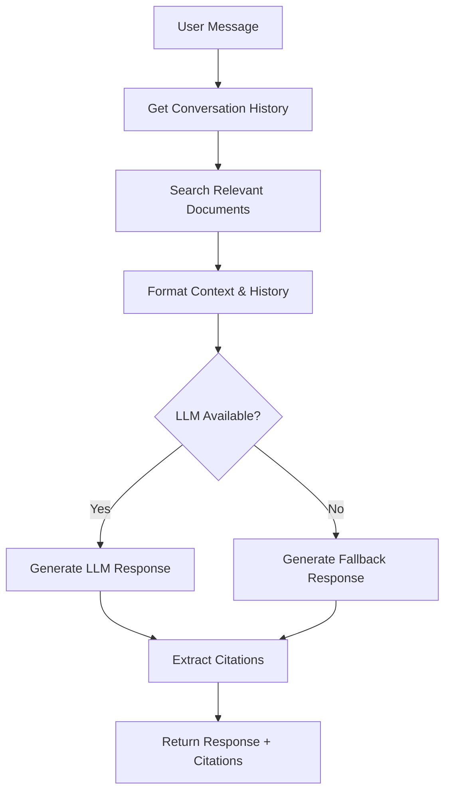

# LLM Integration Guide

This document explains the enhanced LLM integration for multi-turn conversations with RAG (Retrieval-Augmented Generation) capabilities.

## 🚀 Features Implemented

### ✅ Multi-Turn Conversation Support
- **Conversation Memory**: Maintains context across multiple messages
- **History Management**: Automatically handles conversation history up to configurable limits
- **Session Persistence**: Each conversation session maintains its own context

### ✅ LLM Provider Support
- **Azure OpenAI**: Primary integration with full Azure OpenAI API support
- **OpenAI**: Fallback support for standard OpenAI API
- **Graceful Degradation**: Falls back to knowledge base mode when LLM unavailable

### ✅ RAG Integration
- **Document Context**: Automatically retrieves relevant document chunks
- **Smart Citations**: Includes source document references in responses
- **Context Ranking**: Uses vector similarity scores for relevance

### ✅ Enhanced Chat Service Architecture
- **ITSupportChatService**: Main service class handling LLM operations
- **Conversation Chains**: LangChain-based conversation management
- **Memory Buffer**: Sliding window memory for conversation history

## 🔧 Configuration

### Environment Variables

Create or update your `.env` file with the following variables:

```bash
# Azure OpenAI Configuration (Primary)
AZ_OPEN_AI_URL=https://your-resource.openai.azure.com/
AZ_OPEN_AI_CHAT_KEY=your-azure-chat-api-key
AZ_OPEN_AI_CHAT_MODEL=gpt-4o-mini
AZ_OPEN_AI_EMBEDDING_KEY=your-azure-embedding-api-key
AZ_OPEN_AI_EMBEDDING_MODEL=text-embedding-3-small
AZ_OPEN_AI_CHAT_MODEL_TEMPERATURE=0.7

# Pinecone Configuration (for RAG)
PINECONE_API_KEY=your-pinecone-api-key
PINECONE_ENVIRONMENT=gcp-starter
PINECONE_INDEX_NAME=helpdesk-documents

# Fallback OpenAI Configuration (Optional)
OPENAI_API_KEY=sk-your-openai-key
OPENAI_API_BASE=https://api.openai.com/v1

# Optional: Override default settings
CHUNK_SIZE=500
CHUNK_OVERLAP=200
MAX_CONVERSATION_TURNS=20
```

### Application Settings

The system includes several configurable parameters:

```python
# Chat Settings
MAX_CONVERSATION_TURNS: int = 20        # Max messages to keep in memory
SYSTEM_PROMPT: str = "..."              # IT Support system prompt
CHUNK_SIZE: int = 500                   # Document chunk size
CHUNK_OVERLAP: int = 200                # Overlap between chunks

# LLM Settings
AZ_OPEN_AI_CHAT_MODEL_TEMPERATURE = 0.7 # Response creativity (0-1)
```

## 🏗️ Architecture Overview

### 1. Chat Service Class Structure

```python
class ITSupportChatService:
    def __init__(self):
        self.llm = None                 # LLM instance (Azure/OpenAI)
        self.chat_chain = None          # LangChain conversation chain
        self._init_llm()               # Initialize LLM on startup
    
    def generate_response(self, user_message, history, session_id):
        # Main method for generating responses
        pass
```

### 2. LLM Initialization Priority

1. **Azure OpenAI** (if all required env vars present)
2. **OpenAI** (if API key present)
3. **Fallback Mode** (knowledge base only)

### 3. Response Generation Flow



## 🎯 Key Features Explained

### 1. Multi-Turn Conversation Memory

The system maintains conversation context using LangChain's `ConversationBufferWindowMemory`:

```python
memory = ConversationBufferWindowMemory(
    k=settings.MAX_CONVERSATION_TURNS,  # Keep last 20 messages
    return_messages=True,
    memory_key="chat_history"
)
```

**Benefits:**
- ✅ Remembers previous questions and answers
- ✅ Maintains context for follow-up questions
- ✅ Automatically manages memory size to prevent token limits

### 2. RAG-Enhanced Responses

Every response includes relevant context from uploaded documents:

```python
def _get_relevant_context(self, query: str, max_chunks: int = 3) -> str:
    relevant_chunks = search_documents(query, limit=max_chunks)
    # Format chunks with relevance scores and source info
```

**Benefits:**
- ✅ Responses grounded in actual documentation
- ✅ Automatic citation of source documents
- ✅ Relevance scoring for context quality

### 3. Intelligent System Prompt

The system uses a specialized prompt for IT support scenarios:

```
You are an expert IT Support Assistant. You help users with technical issues, troubleshooting, and IT-related questions.

Key guidelines:
- Provide clear, step-by-step solutions
- Ask clarifying questions when needed
- Use the provided context from documentation when available
- Be professional but friendly
- If you don't know something, admit it and suggest next steps
- Always prioritize user safety and data security
```

### 4. Graceful Fallback System

When LLM services are unavailable, the system provides intelligent fallbacks:

- **Knowledge Base Mode**: Still searches documents and provides relevant content
- **Error Handling**: Informative error messages without system crashes
- **Service Recovery**: Automatically retries LLM initialization

## 📊 Response Quality Features

### 1. Context Integration

```python
prompt = ChatPromptTemplate.from_messages([
    ("system", settings.SYSTEM_PROMPT),
    ("system", "Context from knowledge base:\n{context}"),
    MessagesPlaceholder(variable_name="chat_history"),
    ("human", "{input}")
])
```

### 2. Citation Extraction

Automatically extracts document sources from RAG context:

```python
def _extract_citations_from_context(self, context: str) -> List[Dict]:
    # Parses context to extract document filenames and relevance scores
    return [{"filename": filename} for filename in unique_files]
```

### 3. Response Formatting

- **Structured Responses**: Clear sections and formatting
- **Source Attribution**: Automatic citation of relevant documents
- **Error Context**: Helpful error messages when issues occur

## 🧪 Testing the Enhanced System

### 1. Basic Functionality Test

```bash
# Start the backend
uvicorn app.main:app --reload

# Check logs for successful initialization:
# ✅ "Azure OpenAI LLM initialized successfully"
# ✅ "Conversation chain initialized successfully"
```

### 2. Multi-Turn Conversation Test

1. Start a chat session
2. Ask: "What is our password policy?"
3. Follow up: "How often do I need to change it?"
4. Follow up: "What if I forget my password?"

**Expected behavior:**
- Each response should reference previous context
- Responses should include relevant document excerpts
- Citations should appear for document sources

### 3. RAG Integration Test

1. Upload an IT policy document
2. Ask specific questions about the content
3. Verify responses include relevant excerpts
4. Check that citations reference the uploaded document

## 🚨 Troubleshooting

### Common Issues

1. **"Azure OpenAI LLM initialization failed"**
   ```
   Solution: Check Azure OpenAI credentials and endpoint URL
   - Verify AZ_OPEN_AI_URL format: https://your-resource.openai.azure.com/
   - Ensure AZ_OPEN_AI_EMBEDDING_KEY is valid
   - Confirm deployment names match exactly
   ```

2. **"Conversation chain initialization failed"**
   ```
   Solution: Usually related to LLM initialization
   - Check LLM logs above this error
   - Verify all required environment variables
   - Ensure API quotas are not exceeded
   ```

3. **Responses without context**
   ```
   Solution: Check document processing and vector storage
   - Verify documents are status="parsed" 
   - Check Pinecone connection
   - Ensure embeddings are being generated
   ```

4. **Memory/token limit errors**
   ```
   Solution: Adjust conversation parameters
   - Reduce MAX_CONVERSATION_TURNS
   - Decrease CHUNK_SIZE for context
   - Lower max_tokens in LLM config
   ```

### Performance Optimization

1. **Response Speed**
   - Reduce context chunks (max_chunks=2)
   - Use smaller embedding models
   - Implement response caching

2. **Cost Management**
   - Monitor Azure OpenAI usage
   - Implement rate limiting
   - Use cheaper models for development

3. **Memory Usage**
   - Adjust conversation window size
   - Clear old conversations periodically
   - Monitor memory consumption

## 🎯 Advanced Configuration

### Custom System Prompts

Modify the system prompt in `config.py` for specific use cases:

```python
SYSTEM_PROMPT = """You are a specialized Network Support Assistant focused on:
- Network connectivity issues
- VPN troubleshooting  
- Firewall configuration
- Security incident response

Always escalate security issues to the SOC team."""
```

### LLM Parameters

Fine-tune response behavior:

```python
# In document_parser.py or chat_service.py
self.llm = AzureChatOpenAI(
    temperature=0.3,        # Lower = more consistent
    max_tokens=1500,        # Longer responses
    top_p=0.9,             # Nucleus sampling
    frequency_penalty=0.1,  # Reduce repetition
)
```

### Memory Management

Customize conversation memory:

```python
# Longer memory for complex troubleshooting
memory = ConversationBufferWindowMemory(k=50)

# Or use token-based memory
from langchain.memory import ConversationTokenBufferMemory
memory = ConversationTokenBufferMemory(
    llm=self.llm,
    max_token_limit=4000
)
```

## 📈 Monitoring and Analytics

### Key Metrics to Track

1. **Response Quality**
   - User satisfaction ratings
   - Response relevance scores
   - Citation accuracy

2. **Performance**
   - Response latency
   - LLM API usage
   - Vector search performance

3. **System Health**
   - LLM availability
   - Error rates
   - Memory usage patterns

### Logging

The system provides comprehensive logging:

```python
logger.info("Azure OpenAI LLM initialized successfully")
logger.warning("LLM not available, using fallback")
logger.error("Error generating LLM response: {error}")
```

Monitor logs for:
- LLM initialization status
- Response generation success/failure
- Fallback mode activation
- Performance metrics

The enhanced chat service now provides enterprise-grade conversational AI capabilities with full RAG integration, making it suitable for production IT support scenarios!
